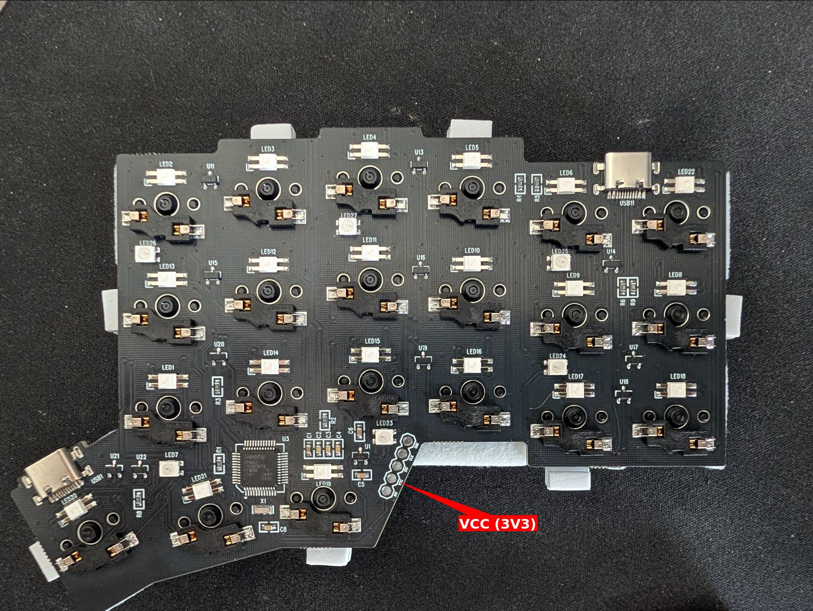
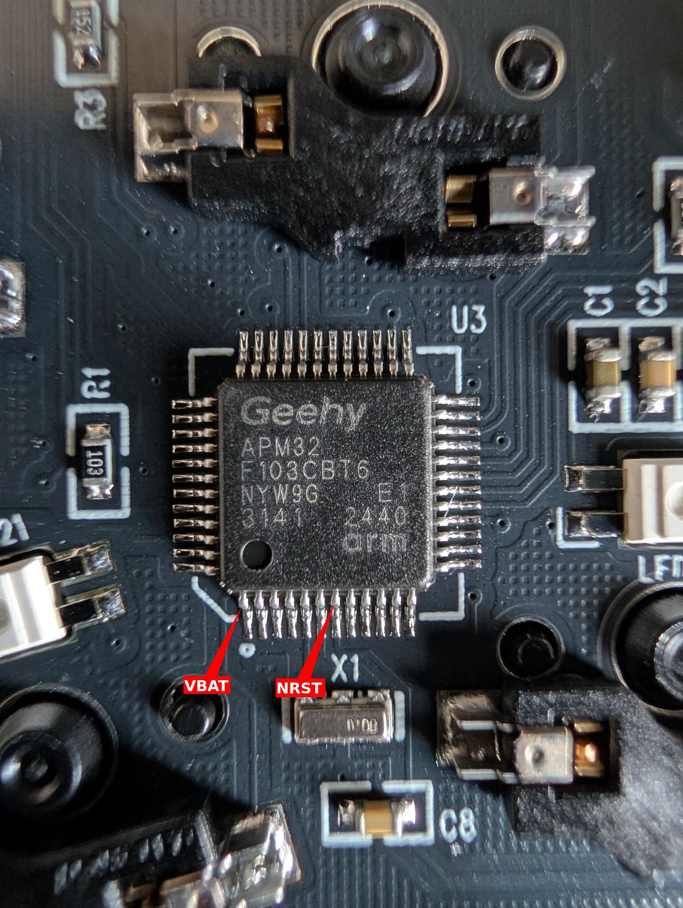
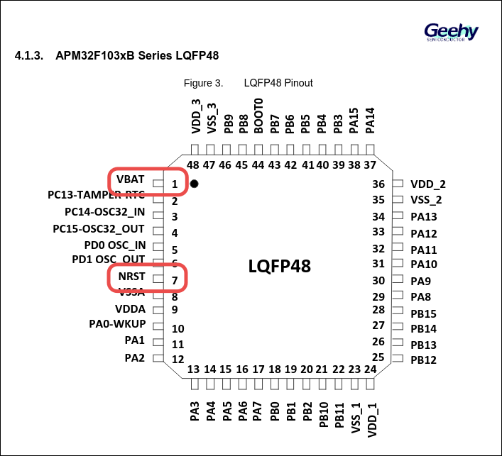

# QH42

42-key split ergonomic keyboard (3x6 + 3 thumb keys per side) based on the STM32F103 MCU.

## Hardware

- MCU: STM32F103 (ARM Cortex-M0)
- Split: yes, connected via USART serial (pin B6)
- LEDs: 54 RGB LEDs (27 per side, key + underglow), WS2812 PWM driver
- Bootloader: UF2
- Handedness: set via EEPROM (`EE_HANDS`)

## Backup

Before flashing new firmware, back up the existing `.uf2` from the bootloader drive. When the board enters UF2 bootloader mode, it exposes a mass storage device — copy the `CURRENT.UF2` file from it before writing anything new.

## Building and flashing

Flash left half:

    qmk flash -kb qh/qh42 -km vial-qh42 -bl uf2-split-left

Flash right half:

    qmk flash -kb qh/qh42 -km vial-qh42 -bl uf2-split-right

If auto-copy to the UF2 drive fails, manually copy the `.uf2` file from `.build/` to the mounted bootloader drive.

## Disaster recovery

This board has no physical reset button. If a bad flash breaks bootmagic (hold-key-on-plug) and the firmware no longer exposes a way to enter the bootloader, you can force the MCU into its built-in system bootloader by shorting the **BOOT0 pin (pin 44)** to **VBAT (pin 1)** while plugging in the board. This forces the chip to boot from the internal system bootloader (DFU) instead of flash, allowing you to reflash.

Use a thin wire or tweezers to bridge BOOT0 to VBAT. Release the short after the board is powered on and recognized by the host.

For the full pin layout, refer to the [APM32F103xB Datasheet V1.3](https://www.geehy.com/uploads/tool/APM32F103xB%C2%A0Datasheet%C2%A0V1.3.pdf), page 22 (Section 4.1.3, LQFP48 pinout). Key pins: NRST = pin 7, VBAT = pin 1, BOOT0 = pin 44.

## EEPROM reset

After changing some firmware defaults (RGB settings, etc.), clear EEPROM to apply them. Map `EE_CLR` to a key in Vial and press it.
